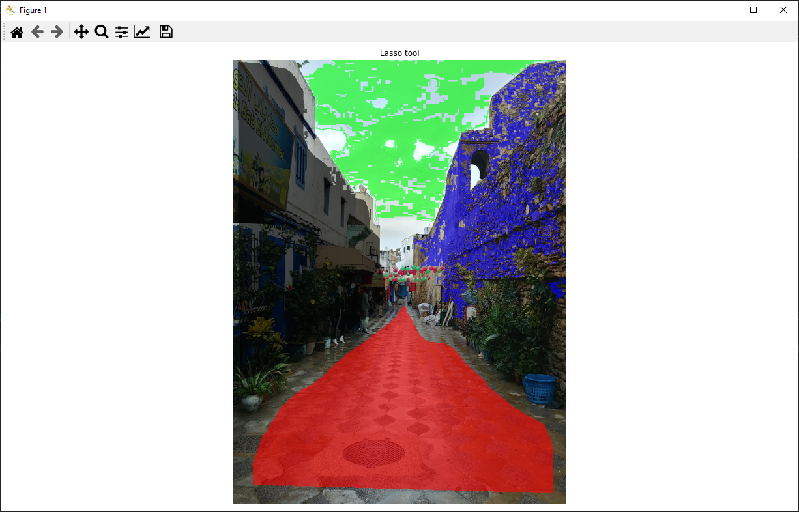

# Python pixel annotation tool
This is a matplotlib interactive tool that allows you to classify pixels in images with one of three tools: single pixel selector, flood fill, lasso tool.

Demonstration video available <a href="https://youtu.be/3B6FFHks2xc">here<a>.

